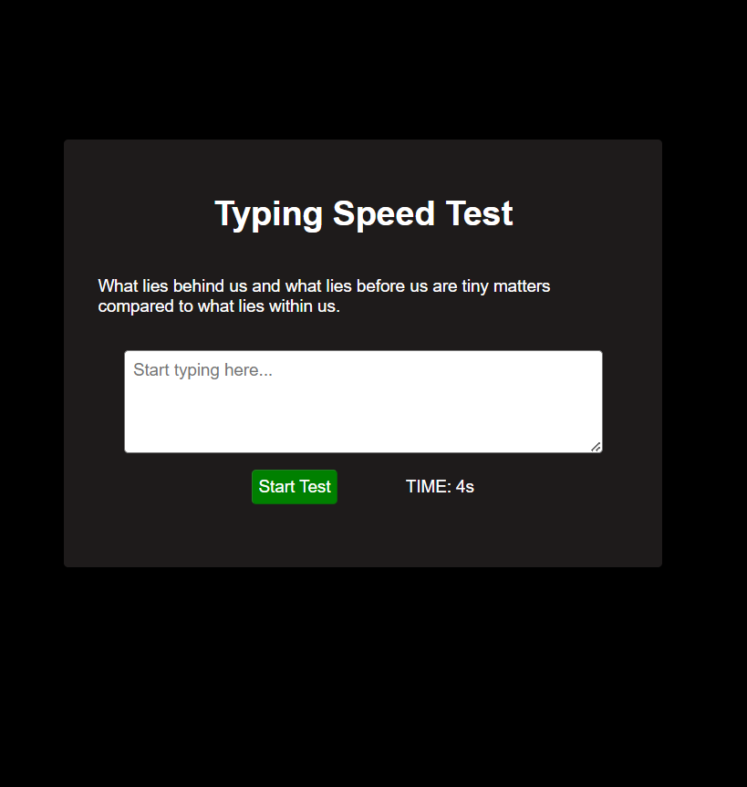
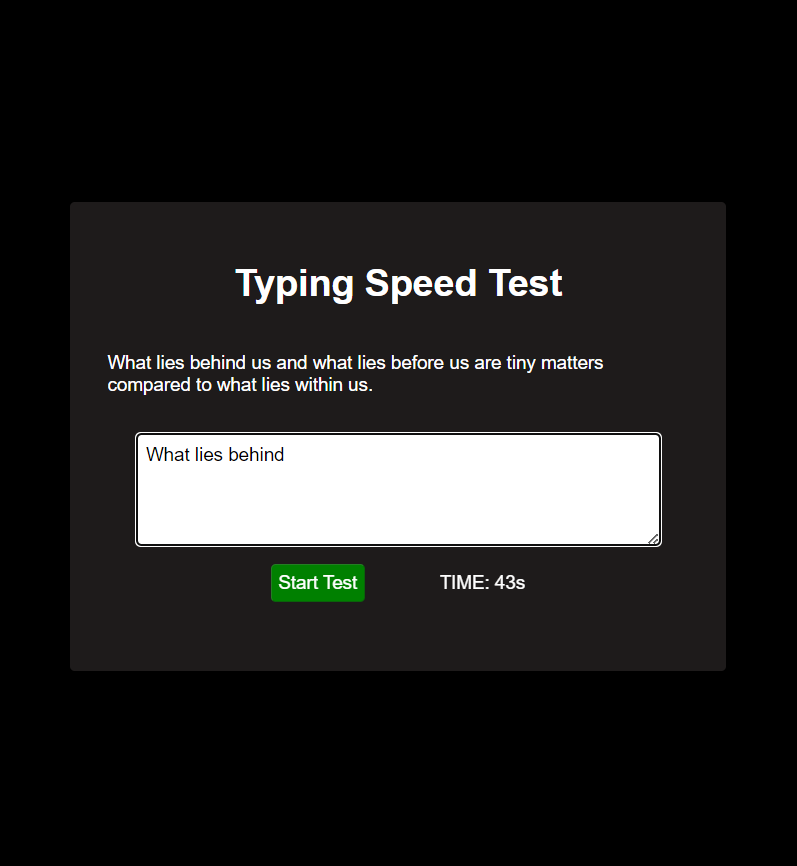

# Typing Speed Tester

A simple and interactive Typing Speed Tester web application that calculates your typing speed in **Words Per Minute (WPM)** and accuracy in real-time. Perfect for improving your typing skills or challenging yourself!

---

## Features

### Core Features:

- **Random Quotes:** Provides random quotes for users to type.
- **Typing Speed Calculation:** Calculates typing speed in Words Per Minute (WPM) based on typed words.
- **Accuracy Feedback:** Measures accuracy by comparing the typed text with the displayed quote.
- **Real-Time Error Highlighting:** Incorrect input is highlighted in **red**, while correct input is highlighted in **green**.
- **Timer:** Tracks the time taken to complete the test in seconds.

### User Interface Features:

- **Minimalistic Design:** Clean and simple UI with a focus on usability.
- **Responsive Layout:** Fully responsive for desktop, tablet, and mobile users.
- **Interactive Feedback:** Displays speed and accuracy dynamically upon completion.
- **Clear Controls:** Start button, typing area, and real-time timer ensure ease of use.

---

## Screenshots

### Home Screen:



### Typing in Progress:



### Results Display:


---

## How to Run

1. **Clone the Repository**:
   ```bash
   git clone https://github.com/methreamarnath1/Typing-Speed-Test.git
   Open the Project: Navigate to the project folder and open index.html in any modern web browser.
   ```

Start Testing:

Click the Start Test button.
Begin typing in the input box as the timer starts.
View your speed and accuracy results upon completion.
How It Works
Start Test:
A random quote is displayed.
Timer starts when you click the Start Test button.
Typing Input:
Input is checked against the displayed quote in real-time.
Errors are highlighted in red, and correct input is highlighted in green.
Results Calculation:
Typing speed is calculated in WPM using the formula:
plaintext
Copy code
WPM = (Number of Words Typed / Time Taken in Minutes)
Accuracy is calculated as:
plaintext
Copy code
Accuracy = ((Correct Characters / Total Characters) \* 100)
Technologies Used
HTML5: Structure of the application.
CSS3: Styling for a clean and responsive UI.
JavaScript: Core functionality for dynamic interaction and calculations.
Future Enhancements
Progress Bar: Add a visual indicator for typing progress.
Leaderboard: Save and display top typing scores.
Dark Mode: Provide a dark mode option for better accessibility.
Custom Text Input: Allow users to input their own text for practice.
License
This project is licensed under the MIT License. Feel free to use, modify, and distribute as needed.

Contributing
Contributions are welcome! Please fork the repository, make your changes, and submit a pull request.
